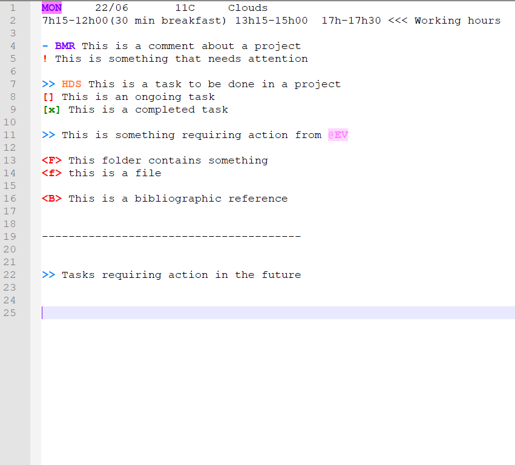

Since I started doing research, I have been keeping track of my activity: algorithms, diagrams, notes, meetings, diary... It is good practice in research, since one wants to keep a backup of ideas and progress.

In the last years, I have changed my logging strategy several times: in the beginning, I used to have a unique notebook for everything; then, I moved to a ring binder where I categorised my notes by topic; and more recently, I started a bullet journal which I used as a supplement to my notes.

A couple of months ago, when I started working from home due to the Covid-19 lockdown, I decided to go paperless with my notes for two main reasons: because I wanted to stop wasting paper and to optimise my reduced working space.

As a Notepad++ lover, I decided to create a week log (following an approach based on bullet journal), together with a monthly file to keep track of ongoing tasks. When notes about certain tasks require more level of detail, a specific file is created for that particular task.

If drawings are needed for a particular concept, idea or pipeline, these are created in a power point file, being these useful for future publications.

For the notes in notepad++, a series of keywords/expressions have been reserved and stored in an xml template file, so these can be highlighted in the log files as it is done for programming languages.

